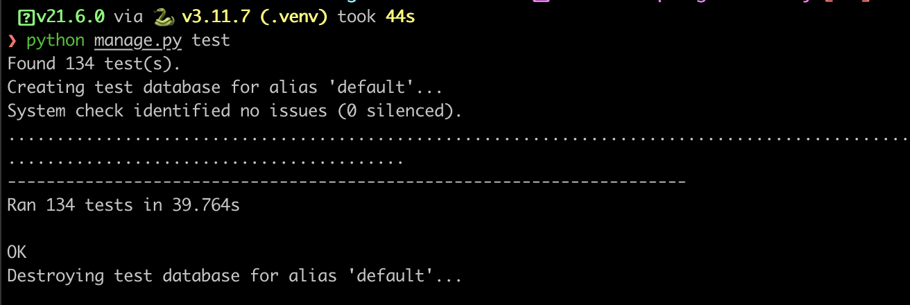

# Technical Manual: Bynle

# Table of Contents

- [1. Introduction](#1-introduction)
  - [1.1. Overview](#11-overview)
  - [1.2. Purpose](#12-purpose)
  - [1.3. Scope](#13-scope)
  - [1.4. Glossary](#14-glossary)
- [2. System Overview](#2-system-overview)
  - [2.1. System Architecture Overview](#21-system-architecture-overview)
  - [2.2. System Components](#22-system-components)
  - [2.3. System Interfaces](#23-system-interfaces)
- [3. High Level Design](#3-high-level-design)
  - [3.1. Use Cases and Sequence Diagrams](#31-use-cases-and-sequence-diagrams)
    - [3.1.1. Use Case 1: User Authentication](#311-use-case-1-user-authentication)
    - [3.1.2. Use Case 2: User Transfers Paid Ticket](#312-use-case-2-user-transfers-paid-ticket)
    - [3.1.3. Use Case 3: Club Admin Creates Free Event](#313-use-case-3-club-admin-creates-free-event)
    - [3.1.4. Use Case 4: Scanner Scans Ticket at Event](#314-use-case-4-scanner-scans-ticket-at-event)
    - [3.1.5. Use Case 5: Club Admin Creates Event with Stripe Integration](#315-use-case-5-club-admin-creates-event-with-stripe-integration)
  - [3.2. Stripe Integration with Clubs](#32-stripe-integration-with-clubs)
  - [3.3. Data Model](#33-data-model)
  - [3.4. Operational Model](#34-operational-model)
- [4. Technical Implementation](#4-technical-implementation)
  - [4.1. Technologies Used](#41-technologies-used)
  - [4.2. Software Architecture Patterns](#42-software-architecture-patterns)
  - [4.3. Third-party Integrations](#43-third-party-integrations)
  - [4.4. Data Storage and Management](#44-data-storage-and-management)
  - [4.5. Security Measures](#45-security-measures)
- [5. Testing and Quality Assurance](#5-testing-and-quality-assurance)
  - [5.1. Test Strategy](#51-test-strategy)
  - [5.2. Test Cases](#52-test-cases)
  - [5.3. Testing Tools and Frameworks](#53-testing-tools-and-frameworks)
  - [5.4. Quality Assurance Measures](#54-quality-assurance-measures)
- [6. Problems and Solutions](#6-problems-and-solutions)
  - [6.1. Issue: ClubAdmins Model Class](#61-issue-clubadmins-model-class)
  - [6.2. Problem: Migrations](#62-problem-migrations)
  - [6.3. Problem: Ticket Transfer and Scanning Workflow](#63-problem-ticket-transfer-and-scanning-workflow)
  - [6.4. Issue: Deployment of Django, React, and Database](#64-issue-deployment-of-django-react-and-database)
- [7. Design Evolution](#7-design-evolution)
  - [7.1. Initial Design (Optional)](#71-initial-design-optional)
  - [7.2. Major Design Changes](#72-major-design-changes)
  - [7.3. Current Design](#73-current-design)
  - [7.4. Lessons Learned](#74-lessons-learned)
- [8. Installation Guide](#8-installation-guide)
- [9. References](#9-references)

# **1. Introduction**

---

## 1.1. Overview

The technical specification document provides a comprehensive overview of the design, architecture, and functionality of the Bynle platform. Bynle is a dynamic web-based platform designed to streamline ticket sales processes for university clubs and societies. It serves as a centralised solution for managing attendees, ticket sales, and event organisation, offering clubs the ability to organise and market their events efficiently while providing users with a seamless experience to discover events, connect with friends, and securely transfer tickets.

---

## 1.2. Purpose

The purpose of this technical specification document is to guide developers, designers, and stakeholders in understanding the intricacies of the Bynle platform. By providing detailed insights into the system's architecture, design principles, implementation strategies, and operational aspects, this document serves as a roadmap for the construction, maintenance, and enhancement of the Bynle platform.

---

## 1.3. Scope

The scope of this technical specification encompasses the design, architecture, functionality, and operational aspects of the Bynle platform. It includes descriptions of system components, interfaces, data models, deployment environments, testing strategies, maintenance procedures, and more.

---

## 1.4. Glossary

In the glossary section, we can provide more detailed definitions for each term, including examples and additional context where necessary. For example:

| Term                               | Definition                                                                                                                                                                                                                                                                                                                      |
| ---------------------------------- | ------------------------------------------------------------------------------------------------------------------------------------------------------------------------------------------------------------------------------------------------------------------------------------------------------------------------------- |
| Backend                            | The server-side component of a software application is responsible for processing requests, managing data, and executing business logic. In the context of Bynle, the backend is implemented using Django, a high-level Python web framework.                                                                                   |
| Frontend                           | The client-side component of a software application responsible for presenting the user interface and interacting with users. In Bynle, the frontend is developed using React, a JavaScript library for building user interfaces.                                                                                               |
| React                              | A JavaScript library for building user interfaces, developed by Facebook. React allows developers to create reusable UI components and build single-page applications with a declarative programming style.                                                                                                                     |
| Django                             | A high-level Python web framework that encourages rapid development and clean, pragmatic design. Django follows the model-view-controller (MVC) architectural pattern and includes built-in features for authentication, URL routing, and database access.                                                                      |
| HTTP                               | Hypertext Transfer Protocol (HTTP) is an application protocol for distributed, collaborative, hypermedia information systems. It is the foundation of data communication on the World Wide Web and defines how messages are formatted and transmitted between web servers and clients.                                          |
| GET/POST/DELETE/PUT/PATCH requests | HTTP methods used for interacting with resources on a web server. GET is used to retrieve data, POST to create new resources, DELETE to remove resources, PUT to update resources, and PATCH to partially update resources.                                                                                                     |
| JSON                               | JavaScript Object Notation (JSON) is a lightweight data interchange format that is easy for humans to read and write and easy for machines to parse and generate. It is commonly used for transmitting data between a web server and a client in a RESTful API.                                                                 |
| RESTful API                        | Representational State Transfer (REST) is a software architectural style that defines a set of constraints for creating scalable web services. A RESTful API adheres to these constraints and enables communication between clients and servers over HTTP using standard methods and formats, such as JSON.                     |
| QR Code                            | A QR code is a type of two-dimensional matrix barcode. In Bynle, a every ticket has a unique QR code. This QR code contains a URL that, when scanned, sends a request to en endpoint where tickets are verified. Only users with predefined permissions will be allowed to access this endpoint.                                |
| Serializers                        | Serializers are used to convert complex data types, such as Django model instances, into Python data types that can be easily rendered into JSON, XML, or other content types. Serializers also provide deserialization, allowing parsed data to be converted back into complex types after first validating the incoming data. |
| Railway                            | Railway is an infrastructure platform where you can provision infrastructure, develop with that infrastructure locally, and then deploy to the cloud. Bynle deploys the backend of the application in Railway cloud servers, along with the database.                                                                           |
| PostgresSQL                        | PostgreSQL, also known as Postgres, is a free and open-source relational database management system emphasizing extensibility and SQL compliance.                                                                                                                                                                               |
| AWS                                | Amazon Web Services, Inc. is a subsidiary of Amazon that provides on-demand cloud computing platforms and APIs to individuals, companies, and governments, on a metered, pay-as-you-go basis.                                                                                                                                   |
| AWS Amplify                        | AWS Amplify Hosting is a fully managed CI/CD and hosting service for fast, secure, and reliable static and server-side rendered apps that scale with your business.                                                                                                                                                             |
| AWS S3 Bucket                      | An Amazon S3 bucket is a public cloud storage resource available in Amazon Web Services (AWS) Simple Storage Service (S3) platform. It provides object-based storage, where data is stored inside S3 buckets in distinct units called objects instead of files.                                                                 |
| Docker Image                       | Docker images are read-only templates that contain instructions for creating a container. A Docker image is a snapshot or blueprint of the libraries and dependencies required inside a container for an application to run.                                                                                                    |
| CDN                                | A content delivery network (CDN) is a group of geographically distributed servers that speed up the delivery of web content by bringing it closer to where users are.                                                                                                                                                           |
| Stripe API                         | Stripe provides a set of programmable APIs and tools to let you facilitate payments and pay out sellers globally. From verifying your sellers' identities to routing payments, Stripe makes it easy for platforms and marketplaces to manage their payments while staying compliant.                                            |
| Pexels API                         | Pexels is a provider of stock photography and stock footage.                                                                                                                                                                                                                                                                    |
| Unit Test                          | In computer programming, unit testing is a software testing method by which individual units of source code                                                                                                                                                                                                                     |

# **2. System Overview**

## 2.1. System Architecture Overview

Bynle's system architecture is designed to be scalable, robust, and efficient. It consists of several layers and components that work together to provide the desired functionality. The key architectural components include:

- **Client Layer**: The client layer consists of the user interface components built using React. It provides an intuitive and responsive interface for users to interact with the platform.
- **Application Layer**: The application layer contains the business logic of the system implemented using Django. It includes modules for user management, event management, ticketing, and social features. In the Bynle system, React is used to build the client-side user interface, including pages for event browsing, ticket purchasing, user profile management, and more. React components interact with the backend through RESTful API calls to fetch and update data.
- **Data Layer**: The data layer comprises a PostgreSQL database used to store and manage data such as user profiles, event details, tickets, and social connections.
- **Integration Layer**: The integration layer serves as a bridge for communicating with external services like the Stripe API for payment processing and authentication providers for user authentication. Additionally, a clever algorithm has been implemented to ascertain the connection status between clubs or users with Stripe. Leveraging this status, the system can determine whether users or clubs are permitted to perform actions such as charging for events or transferring tickets.
- **Deployment Layer: The Bynle system is hosted on Railway, a platform that simplifies deployment and management of web applications. Railway provides infrastructure for hosting applications, ensuring reliability and scalability. This deployment environment ensures efficient operation and easy management of the Bynle platform.**


## 2.2. System Components

The main components of the Bynle system include:

- **Authentication Handler:** Manages all functions related to authentication from users. This component checks the token (cookie) sent from the frontend server and authenticates users. Bynle has two user types: `user` and `ticket_scanner`. Some of the functions are:
  - `UserTokenObtainPairView` → Sends token to user of type `user`.
  - `TicketScannerTokenObtainPairView` → Sends token to user of type `ticket_scanner`.
  - `RegisterView` → Registers a new user of type `user`.
    All of the functions have embedded validation (Serializers in Django).
- **Club Handler**: Enables logic related to a Club, listed are the three handlers with the functions in them.
  - Club creation, update and view:
    - `ClubViewSet`, `CreateClubView`, `ClubUpdateView`
  - Club Admin logic:
    - `ClubAdminView`, `ClubsAdminedByUserView`, `AdminsInClubView`, `RemoveClubAdminView`, `AddClubAdminView`
  - Follow logic (User follows club):
    - `FollowViewSet`, `UserFollowsClubView`, `UserFollowsView`, `CommonClubsView`
- Stats Handler: Creates statistics for clubs (Pie chart with the year of study of the club’s followers):
  - `StatEventsYearView`, `StatClubFollowersView`
  - The following is the endpoint that returns processed data for the frontend to render a graph. I queries the database to get the course and year of the followers of a club:
    
- **Event Handler**: Facilitates creation, scheduling, and management of events hosted by clubs.
  - `EventViewSet`, `ClubEventsView`, `UserEventsView`, `EventSoldOutView`
- **Friendship Handler:** Manages friend requests between users, creates them and changes their status:
  - `FriendViewSet`, `UserFriends`, `CommonFriendsView`, `CreateFriendRequest`, `CreateFriendRequest`
- **Scanner Handler:** Scanners are Users of type `ticket_scanner`, they can scan tickets. These scanners are created by Club Admins:
  - `CreateTicketScannerView`, `TicketScannerUserPasswordResetView`, `TicketScannerUserListView`, `TicketScannerUserDeleteView`, `ValidateTicketView`, `RetrieveEventTicketsView`,
  - Here is an example of the Validate Ticket View endpoint. It validated a ticket with the condition that the user accessing the endpoint is a Ticket Scanner.
    
- **Payment Handler**: Handles payment processing for ticket purchases and other transactions within the platform like the ticket transferring. Connects to Stripe API:
  - `StripeAccountClubView`, `StripeStatusUserView`, `CreateStripeUserCheckoutSession`…
  - Here is a function that connects to Stripe with an API to create a checkout form when a user is buying a ticket:
    
- **Ticket Handler**: Manages the creation of tickets.
  - `TicketViewSet`, `UserTicketsView`, `UserHasTicketView`
- **Transfer Handler:** Handles the logic for transferring tickets between users:
  - `TransferRequestViewSet`, `AvailableToTransferTicketsView`, `CreateTransferRequest`, `UserReceivedTransferRequestView`, `CanAcceptTransferView`...
  - Here is the endpoint that accepts a ticket transfer. The old ticket is deleted from the database, and a new one is created for the user that accepted the rain.
    
- **User Handler:** Handles Profile public data related to users:
  - `UserViewSet`, `ProfileViewSet`, `UserPersonalProfileView`...

## 2.3. System Interfaces

The interfaces of the Bynle system include:

- **RESTful API**: Provides interfaces for client-server communication, allowing clients to interact with the server and perform various operations.
  - The following is a Serializer that validates the data when a user is created. It receives the data and creates the User and a Profile:
    
- **Database Interface**: Allows the application layer to interact with the PostgreSQL database, performing data manipulation and retrieval operations.

# **3. High Level Design**

In the high-level design phase, we outline the key functionalities and interactions of the Bynle platform through use cases and sequence diagrams.

These diagrams provide a visual representation of how users and system components interact to achieve various tasks. Let's dive into the use cases and sequence diagrams:

## 3.1. Use Cases and Sequence Diagrams

Each use case describes a specific action or scenario within the system, offering insights into the functionality and user interactions.

### 3.1.1. Use Case 1: User Authentication


- **Actors:** User
- **Description:** This use case facilitates user authentication, allowing users to securely access the platform.
- **Preconditions:** None
- **Main Flow:**
  1. User accesses the login or registration page.
  2. User enters their credentials (username/email and password).
  3. The system verifies the user's credentials.
  4. Upon successful verification, the user gains access to the platform.
- **Postconditions:**
  - The user is authenticated and granted access to the platform

### 3.1.2. Use Case 2: User Transfers Paid Ticket


- **Actors**: User, User2
- **Description**: Allows users to transfer event tickets to other users.
- **Preconditions**: User must have purchased tickets for an event. If ticket price > 0 then user must setup Stripe to receive payment safely.
- **Main Flow**:
  1. User navigates to the ticket transfer page.
  2. User selects the ticket(s) to transfer and enters the friend’s username.
  3. User confirms the ticket transfer.
  4. System validates the transfer request and updates ticket ownership.
- **Postconditions**: Tickets are successfully transferred to the designated recipient.

### 3.1.3. Use Case 3: Club Admin Creates Free Event


- **Actors:** Club Admin
- **Description:** This use case enables club administrators to create free events on the platform.
- **Preconditions:**
  - Club admin must be logged in.
- **Main Flow:**
  1. Club admin navigates to the event creation page.
  2. Club admin fills out the event details, including event name, date, location, and price = 0.
  3. Club admin submits the event creation form.
  4. The system verifies the provided information and creates a new event associated with the club.
- **Postconditions:**
  - A new event is successfully created and added to the platform, accessible to users for registration and attendance.

### 3.1.4. Use Case 4: Scanner Scans Ticket at Event


- **Actors**: Ticket Scanner User
- **Description**: Allows designated ticket scanner users to scan event tickets for validation.
- **Preconditions**: Ticket scanner user must have appropriate permissions and access to the ticket scanner interface.
- **Main Flow**:
  1. Ticket scanner user logs into the ticket scanner interface.
  2. Ticket scanner user uses the scanner to scan each attendee's ticket QR code.
  3. System verifies the validity of each scanned ticket.
- **Postconditions**: Attendees with valid tickets are granted entry to the event.

### 3.1.5. Use Case 5: Club Admin Creates Event with Stripe Integration


- **Actors**: Club Admin
- **Description**: Allows club administrators to create new events on the platform with integrated payment processing using Stripe.
- **Preconditions**: Club administrator must be logged in and have permission to create events.
- **Main Flow**:
  1. Club admin navigates to the event creation page.
  2. Club admin fills out the event details, including ticket pricing and payment settings.
  3. Club admin selects to create a Stripe account and completes the Stripe integration.
  4. Club admin submits the event creation form.
  5. System verifies the provided information and creates a new event associated with the club, setting up Stripe for ticket payments.
- **Postconditions**: Event is created with Stripe integration enabled for ticket sales.

## 3.2. Stripe Integration with Clubs.


- The Bynle system checks if the club's Stripe Connect account is complete. If not, the club is prompted to complete their account setup.
- Once the club's account setup is complete, they are allowed to charge for events, and payment transactions are processed through their Stripe Connect account.
- Payment transactions flow through the club's Stripe Connect account, ensuring seamless and secure payments for event tickets and other transactions.

## 3.3 Data Model

The data model of the Bynle system includes the following entities:

- **User**: Stores information about registered users, including username, email, password hash, and profile details.
- **Event**: Represents events created by clubs, including event name, date, location, description, and associated club.
- **Ticket**: Represents tickets purchased by users for events, including ticket type, price, ownership information, and event association.
- **Club**: Represents clubs or societies registered on the platform, including club name, description, and administrators.
- **Stripe:** Represents Stripe Connect accounts created by clubs or users, enable them to update account information, complete accounts.
- **Follow:** Relates a User and a Club, these two foreign keys are unique together. Represents a User following a Club.
- **Friend**: Relates two Users (Sender and Receiver). It represents a Friendship. If the status is False, it is a pending friendship request, otherwise, the two Users are ‘Friends’.
- **Transfer Request:** Represent a transfer request between two Users (Sender and Receiver), a Ticket, and a pending status (True or False).


## 3.4 Operational Model

The operational modeling is the approach Bynle has taken for making and capturing decisions about the operational architecture of the computer system. This model specifies, at a high level of abstraction, how the components of the application are organised and connected, where they are located and hosted, and what business requirements the application resolves.


Bynle benefits from deploying in different servers for many reasons, some of them being security and scalability. The different nodes and components of the diagram will be further developed in the Technical Implementation section.

# **4. Technical Implementation**

## 4.1 Technologies Used

- **Frontend**: React.js
- **Backend**: Django
- **Database**: PostgreSQL
- **Cloud Storage**: AWS S3 Bucket
- **CDN**: Pexels API
- **Payment Processing**: Stripe API
- **Ticket Scanning**: HTML5-based scanning library
- **Deployment Platform**
  - Backend and Database: Railway
  - Frontend: AWS Amplify

## 4.2 Software Architecture Patterns

- **Client-Server Architecture**: Separation of concerns between frontend (client) and backend (server) components.
- **Model-View-Controller (MVC)**: Organising codebase into models, views, and controllers for better maintainability and scalability. While also organising the views into independent views.
- **Microservices Architecture**: Decoupling functionality into smaller, independent services for modularity and flexibility.
- **Backend Server Deployment**: Railway. The PostgresSQL database instance is pulled from a Docker Image and ran in a Container inside the Railway server, alongside the Django backend application.
  - It can be seen on the image how Railway integrates seamlessly with Github, it pulls from predefined branches and runs a script that executes the project:


- This is the script that is being executed to run the Django application:
  ```bash
  web: python manage.py migrate && python manage.py collectstatic && gunicorn backend.wsgi
  ```
- As for the database, PostresSQL is running in a container, which is accessible throughout the internet with the appropriate credentials. Therefore, for the purpose of the demonstration, we have created a Python script to populate the database according to the requirements of the Django application. The following are an image showing the PostgresSQL instance with the tables and a script to populate it.


```python
import random
from django.contrib.auth import get_user_model
from django.utils import timezone
from datetime import timedelta
from ticketsystem.models import Club, Event, Friend, Follow, Ticket
from ticketsystem.utils import ticketQRCodeGenerator, ticketCodeGenerator
from django.core.files.base import ContentFile
User = get_user_model()
# User and Profile
users_data = {
    'Ava Johnson': {
        'student_id': 102345,
        "bio": "Hey there! I'm Ava Johnson, a spirited university student with a heart full of creativity and a love for vibrant events. University life, to me, is a kaleidoscope of opportunities where I get to explore my artistic side. As an active member of the Art Club, I find immense joy in turning blank canvases into expressive stories. University events are my playground to meet new people, share ideas, and create memories that last a lifetime. In the future, I dream of merging my artistic passion with technology, perhaps bringing a touch of innovation to visual storytelling."
    } ...}
courses = ['BS', 'DS', 'COMSCI', 'COMBUS', 'ACM']
for name, user_data in users_data.items():
    first_name, last_name = name.split()
    username = first_name.lower()
    user = User.objects.create_user(
        username=username,
        email=f'{username}@mail.dcu.ie',
        password=f'{first_name.capitalize()}12345',
        student_id=user_data["student_id"],
        first_name=first_name,
        last_name=last_name,
        user_type='user'    )
    user.profile.birthday = timezone.now().date() - timedelta(days=random.randint(7000, 9000))
    user.profile.course = random.choice(courses)
    user.profile.year = random.randint(1, 5)
    user.profile.description = user_data["bio"]
    user.profile.verified = random.choice([True, False])
    user.profile.save()
clubs_data = {
    "clubs": [
        {
            "name": "Badminton Club",
            "description": "Smash, Rally, Triumph!",
            "content": "Welcome to the exhilarating world of the Badminton Club, where shuttlecocks soar and racquets clash in the pursuit of athletic excellence. Our club is a dynamic community that caters to badminton enthusiasts of all skill levels. Whether you're a seasoned player or a complete beginner, our friendly environment provides the perfect platform to hone your skills and connect with fellow shuttlecock enthusiasts.\n\nImmerse yourself in the thrill of our Smash Tournaments, where competitors showcase their finesse on the court. Join our Doubles Challenges to experience the synergy of teamwork and strategic play. Beginners are invited to embark on their badminton journey through engaging workshops, designed to introduce the basics and foster a love for the sport. Additionally, our Badminton Marathons and Mixed Doubles Mixers create a vibrant atmosphere of camaraderie, ensuring that every member feels a sense of belonging and sportsmanship. Join us in the fast-paced world of badminton, where every rally is a step towards personal growth and shared success."
        } ...
}# Club
for club_data in clubs_data["clubs"]:
    club = Club.objects.create(
        name=club_data["name"],
        description=club_data["description"],
        email=f'{club_data["name"].replace(" ", "").lower()}@dcu.ie',
        content=club_data["content"]
    )
    club_admins = random.sample(list(User.objects.all()), random.randint(1, 3))
    club.club_admins.add(*club_admins)
# Event
club_event_titles = {
    'Badminton Club': ['Smash Tournament', 'Doubles Challenge', 'Beginners\' Workshop', 'Badminton Marathon', 'Mixed Doubles Mixer']
		....}
locations = ['The Hive', 'DCU Gym', 'DCU labs', 'The Venue at DCU']
event_types = [choice[0] for choice in Event.EVENT_CHOICES]
for club in Club.objects.all():
    event_titles = club_event_titles[club.name]
    for title in event_titles:
        event = Event.objects.create(
            title=title,
            description=f'This is {title}. Join us for a great time!',
            price=0,
            date=timezone.now().date() + timedelta(days=random.randint(30, 365)),
            time=timezone.now().time(),
            capacity=random.randint(5, 40),
            soldout=False,
            location=random.choice(locations),
            event_type=random.choice(event_types),
            club=club)
# Friend
users = list(User.objects.all())
for user in users:
    friends = random.sample([u for u in users if u != user], random.randint(0, 15))
    for friend in friends:
        Friend.objects.create(
            sender=user,
            receiver=friend,
            status=random.choice([True, False]))
# Follow
for user in users:
    clubs = random.sample(list(Club.objects.all()), random.randint(1, 6))
    for club in clubs:
        Follow.objects.create(user=user, club=club)
# Ticket
for user in users:
    events = random.sample(list(Event.objects.all()), random.randint(1, 7))
    for event in events:
        if Ticket.objects.filter(event=event).count() < event.capacity:
            # Create the ticket without the QR code
            ticket = Ticket.objects.create(
                title=event.title,
                code=ticketCodeGenerator(),
                price=event.price,
                status='A',
                user=user,
                event=event)
            # Generate the QR code using the ticket ID
            qr_code_image = ticketQRCodeGenerator(ticket.id)
            ticket.qr_code.save(f"ticket_{ticket.id}_qr_code.png", ContentFile(qr_code_image.getvalue()))
            ticket.save()
```

## 4.3 Third-party Integrations

- **Stripe API**: Integration for secure payment processing and Connect account set up to receive payments.


- **Cloud Storage Integration**: Integration with AWS S3 Bucket for managing uploaded media assets.


## 4.4 Data Storage and Management

- **Database**: PostgreSQL is used for storing structured data such as user profiles, event details, tickets, and club information.
- **Cloud Storage**: Bynle employs cloud storage services like AWS S3 to efficiently store and manage uploaded media assets, including event posters and profile pictures. This ensures scalable, reliable, and secure storage infrastructure for the platform's media assets, enhancing performance and data management capabilities.

## 4.5 Security Measures

- **Data Encryption**: Utilised HTTPS encryption for secure communication and encryption mechanisms for protecting sensitive data.
- **Access Controls**: Implemented role-based access control (RBAC) and fine-grained permissions to restrict access to sensitive resources.
- **Password Hashing**: Django automatically provides a robust system for password hashing. When a user creates an account or changes their password, Django uses the PBKDF2 algorithm with a SHA256 hash function. This algorithm is recommended by NIST for password hashing. The hashed version of the password is stored in the database, along with the salt (a random string that is used to add complexity to the hashing process). When a user logs in, Django hashes the entered password with the stored salt and compares it to the stored hash. This ensures that even if the database is compromised, the actual passwords are not directly accessible. Django also offers support for other password hashing algorithms, and allows for easy substitution of a custom password hasher if desired.
- JWT (JSON Web Tokens)
  - In Django, JWT are often used for authentication purposes. When a user logs in, the server verifies the user's credentials and creates a JWT, which contains encoded information about the user, and sends it back to the client. This JWT is then stored client-side, often in local storage, and sent with each subsequent request that requires authentication, typically in the header of the request.
  - In React, when making requests to a server that requires authentication, the JWT is added to the headers of the request. Bynle uses the HTTP axios. When the server receives the request, it decodes the JWT to verify its authenticity and check the user's permissions. If the JWT is valid, the server processes the request. If the JWT is not valid, the server returns an error, and the user is typically prompted to log in again.
- **Private Routes with React Router Dom:** A `PrivateRoute` component is created. This component wraps the `Route` component from React Router DOM and adds an authentication check. The authentication check verifies if the user is authenticated. If the user is authenticated, it renders the component that was passed as a prop, otherwise, it redirects the user to the login page. Here is a simple example of tue `PrivateRoute` implementation for Users of type `user` and `ticket_scanner`:

```jsx
import { Navigate, Outlet } from "react-router-dom";
import { useContext } from "react";
import AuthContext from "../context/AuthContext";

const PrivateRoute = ({ children, ...rest }) => {
  let { user, userType } = useContext(AuthContext);
  if (userType === "ticket_scanner") {
    return <Navigate to="/scan-ticket" />;
  }
  return user && userType === "user" ? <Outlet /> : <Navigate to="/landing" />;
};
const PrivateRouteForScanners = ({ children, ...rest }) => {
  let { user, userType } = useContext(AuthContext);
  return user && userType === "ticket_scanner" ? (
    <Outlet />
  ) : (
    <Navigate to="/landing" />
  );
};
export { PrivateRoute, PrivateRouteForScanners };
```

# **5. Testing and Quality Assurance**

## 5.1 Test Strategy

- **Code Review Process**: Implement a code review process in GitLab, where changes cannot be merged into the main branch without review by at least one other team member. This ensures that code changes are reviewed for quality, correctness, and adherence to coding standards before being integrated into the codebase.
- **Unit Testing**: Develop unit tests for backend models and views using Django's built-in testing framework. These tests should cover critical functionalities and edge cases to ensure the correctness of business logic and data manipulation operations.
- **User Acceptance Testing (UAT)**: Conduct user acceptance testing to validate the UI/UX design and ensure that features meet user requirements and expectations. This testing can be performed by real users or stakeholders, focusing on usability, accessibility, and user satisfaction.

## 5.2 Test Cases

- **Backend Unit Testing**:
  - Develop unit tests for backend models to validate data integrity, validation rules, and database interactions.
  - Write unit tests for backend views to verify request handling, response generation, and business logic execution. Here is a Unit Test written to test the Validate Ticket Endpoint, which is only accessible to Users of type `ticket_scanners`.
    
  - Altogether we have written **134** **unit** tests for our backend.
    
    Shows all the tests being passed successfully
- **User Interface Testing**:
  - Perform user testing to validate the UI design, layout, and usability of the application.
  - Test user interactions and workflows to ensure that features are intuitive and easy to use.

## 5.3 Testing Tools and Frameworks

- **GitLab Code Review**: Utilise GitLab's merge request feature for code reviews, ensuring that changes are reviewed before being merged into the main branch.
- **Django Test Framework**: Use Django's built-in testing framework for writing and running unit tests for backend models and views.
- **User Testing**: Conduct user testing sessions with real users or stakeholders to gather feedback on the application's UI/UX design and feature usability.
- **User Testing Outcomes**:

  - Notification Bell on the Navbar: Users expressed the need for quick access to friend requests and transfer pages. They appreciated the convenience of having a notification bell directly on the navbar, enabling them to promptly respond to incoming requests without the need to manually check for updates.
  - Delete Sent Transfers: Participants highlighted the importance of having the option to delete transfer requests they had sent inadvertently or in case of a change of plans. They suggested that incorporating a feature to delete sent transfers would enhance user control and experience.

  User testing proved invaluable, providing valuable insights and shedding light on areas for improvement within the platform.

  

## 5.4 Quality Assurance Measures

- **Code Reviews**: Enforce code reviews for all changes using GitLab's merge request workflow, ensuring that code changes are reviewed by team members before being merged into the main branch.
- **Unit Testing**: Maintain a suite of unit tests for backend models and views to catch regressions and ensure the reliability of critical functionalities.
- **User Testing**: Conduct regular user testing sessions to gather feedback on the application's UI/UX design and feature usability, iterating based on user feedback to improve the overall user experience.

# **6. Problems and Solutions**

## 6.1. Issue: ClubAdmins Model Class

- **Problem**: Initially, a model class was designed for managing club administrators. However, it was realised that a Many-to-Many relationship was more suitable for representing the relationship between users and clubs.
- **Solution**: The model class was refactored to use a Many-to-Many relationship, allowing for more flexibility and efficiency in managing club administrators. This change enabled seamless association of multiple users with multiple clubs and simplified the administration process.

## 6.2. Problem: Migrations.

- **Problem:** This happened at the beginning of the project, both of us were working in separate branches and making migrations as we modified the models. Due to our poor knowledge of Django migrations, we both had deleted migrations. When rebasing our branches to pull into main, the database broke. We spent a long time debugging and trying to figure our why this had happened, only to find that we had both tampered with the migrations and now the database didn’t match what was on the models.
- **Solution:** After this, we both agreed to NEVER delete the migrations, unless we had a backup of the database and a full wipe was required due to a significant change in the functionality of the app. Luckily, we were fast at populating the database, due to our Populate Database script (referenced above).

## 6.3. Problem: Ticket Transfer and Scanning Workflow

- **Problem:** Ticket Transfer and Activation. During the ticket transfer process, there was a challenge in ensuring that transferred tickets remained inactive until the transfer is completed. This posed a risk of unauthorised access if tickets were inadvertently activated before the transfer process was finalised.
- **Solution:** To address this issue, we implemented a mechanism where tickets remain in a transfer state ("T") until they are either accepted by the recipient user or the transfer request is cancelled by the sender. This ensures that tickets cannot be scanned and are considered invalid until the transfer is successfully completed or cancelled. By maintaining the transfer state until the transfer process is finalised, we ensure the integrity of the ticket transfer process and prevent unauthorised access to events.

## 6.4. Issue: Deployment of Django, React, and Database

- **Problem**: Deploying the Django backend, React frontend, and database components together posed challenges in terms of infrastructure management and deployment configuration. We spend many days reading documentation on these services and countless hours on failed deployment attempts for the backend server.
- **Solution**: Luckily, we came across Railway, which integrates with Github and pulls the last version of a predetermined branch. After many failed attempts, the app was finally deployed along with a Database in a shared instance of a server on Railway.

# 7. Design Evolution:

## 7.1 Initial Design (Optional)

Our initial design concept aimed to develop a secure ticket transfer software where users could safely transfer their tickets obtained from platforms like Ticketmaster to others. The idea was to facilitate a seamless transfer process: User 1 would initiate the transfer, User 2 would pay for the ticket within the app, and upon verification, the transfer would be completed. This solution aimed to address the prevalent issue of ticket scams during resale transactions. However, we weren't satisfied with the security of using their APIs and the level of verification they provided. As a result, we decided to pivot towards creating our ticketing system.

## 7.2 Major Design Changes

After evaluating the limitations of existing ticketing platforms, we opted to develop our own ticket selling application. This bespoke solution is specifically tailored for university clubs, providing them with a platform to sell tickets directly. Additionally, we integrated a feature that allows users to transfer tickets securely within our app. Our proprietary algorithm ensures that ticket transfers are verified safely, addressing the security concerns that initially led us to pivot from relying on external APIs

## 7.3 Current Design

The decision to pivot towards a social media-based web application for university clubs stemmed from our initial aspiration to create a ticket-selling platform tailored to the collegiate environment. However, as we delved deeper into the project, we recognised an opportunity to foster a sense of community and connectivity among students beyond mere ticket transactions. Thus, the current design emphasises features that promote social interaction, such as the ability to connect with friends, follow clubs, and share event experiences. By integrating these social elements into the platform, we aim to cultivate a vibrant community where students can discover, engage with, and actively participate in university events while forging meaningful connections with peers and organisations.

## 7.4 Lessons Learned

Working collaboratively as a pair on our third-year project has taught us several valuable lessons:

1. **Effective Collaboration**: Collaborative problem-solving and clear communication are essential for successful teamwork.
2. **Adaptability**: Flexibility and adaptability are key when navigating evolving project requirements.
3. **Time Management**: Prioritising tasks and managing time effectively is crucial for meeting project milestones.
4. **Feedback and Iteration**: Embracing feedback and iterating on our work leads to continuous improvement.
5. **Resilience**: Perseverance and resilience are necessary to overcome challenges in software development.
6. **Celebrating Successes**: Recognising achievements, no matter how small, boosts morale and motivation.

# **8. Installation Guide**

## Installation Steps:

1. **Clone the Git Repository:**

   - Open a terminal or command prompt and run the following command:

     ```bash

     git clone 2024-CA326-fbustamante-ticket-selling-platform

     ```

2. **Install Backend Dependencies:**

   - Navigate to the backend directory of the cloned repository:

     ```bash

     cd code/backend

     ```

   - Install Python dependencies using pip:

     ```

     pip install -r requirements.txt

     ```

3. **Start Backend Server:**

   - Run the following command to start the backend server:

     ```

     python manage.py runserver

     ```

4. **Install Frontend Dependencies:**

   - Navigate to the frontend directory of the cloned repository:

     ```bash

     cd code/frontend

     ```

   - Install Node.js dependencies using npm:

     ```

     npm install

     ```

5. **Start Frontend Server:**

   - Run the following command to start the frontend server:

     ```sql

     npm start

     ```

# **9. References**

| Description                                                               | Link to referece                                                                                                                                     |
| ------------------------------------------------------------------------- | ---------------------------------------------------------------------------------------------------------------------------------------------------- |
| ChatGPT to get content for clubs and Socs                                 | https://chat.openai.com/share/f4eeeeaa-5bb3-4a56-89ad-ea6212ed2929                                                                                   |
| react-multi-carousel library                                              | https://github.com/YIZHUANG/react-multi-carousel?tab=readme-ov-file                                                                                  |
| Connect Django to react                                                   | https://blog.nextideatech.com/how-to-create-a-django-app-and-connect-it-to-a-database/                                                               |
| Install PostgresSQL on mac M1 with HomeBrew                               | https://sqlpad.io/tutorial/postgres-mac-installation/                                                                                                |
| PostgresSQL installation with docker (much better than traditional setup) | https://scriptable.com/postgresql/how-to-install-postgresql-mac-docker/                                                                              |
| PostgresSQL installation with docker (official)                           | https://www.docker.com/blog/how-to-use-the-postgres-docker-official-image/                                                                           |
| docker PostgresSQL github official                                        | https://github.com/docker-library/docs/blob/master/postgres/README.md#database-configuration                                                         |
| Connect Django to react using docker                                      | https://brandonlecky.medium.com/react-django-integration-in-a-few-simple-steps-390d02dff67d                                                          |
| Django react PostgresSQL with docker                                      | https://dev.to/anjalbam/dockerize-a-django-react-and-postgres-application-with-docker-and-docker-compose-by-anjal-bam-e0a                            |
| React user login plugin                                                   | https://auth0.com/blog/complete-guide-to-react-user-authentication/                                                                                  |
| Images in Django                                                          | https://codinggear.blog/how-to-upload-images-in-django/                                                                                              |
| Serve media files in ASW S3 to Django                                     | https://www.makeuseof.com/django-aws-s3-bucket-host-static-media-files/                                                                              |
| Create QR Codes                                                           | https://medium.com/@rahulmallah785671/create-qr-code-by-using-python-2370d7bd9b8d#:~:text=To%20create%20a%20QR%20code,a%20text%20or%20a%20URL.       |
| After deleting db schemas, run this to get the migrations working         | https://dba.stackexchange.com/questions/106057/error-no-schema-has-been-selected-to-create-in                                                        |
| Ticket QR scanner                                                         |                                                                                                                                                      |
| Testing in Django                                                         | https://realpython.com/testing-in-django-part-1-best-practices-and-examples/                                                                         |
| Gitlab CI Django testing                                                  | https://medium.com/@mridho2828/gitlab-ci-to-test-and-deploy-django-rest-api-297618cb2d90                                                             |
| .gitlab-ci.yml file for Django testing                                    | https://gitlab.com/gitlab-org/gitlab/-/blob/master/lib/gitlab/ci/templates/Django.gitlab-ci.yml                                                      |
| Django Session-based Auth for Single Page Apps                            | https://testdriven.io/blog/django-spa-auth/                                                                                                          |
| Stripe Documentation                                                      | https://docs.stripe.com/checkout/quickstart                                                                                                          |
| Connect React to Django                                                   | https://medium.com/@devsumitg/how-to-connect-reactjs-django-framework-c5ba268cb8be                                                                   |
| Deploy Django on Railway                                                  | https://alphasec.io/how-to-deploy-a-python-django-app-on-railway/#:~:text=Sign%20up%20for%20an%20account,deploy%20Django%20instantly%20on%20Railway. |
