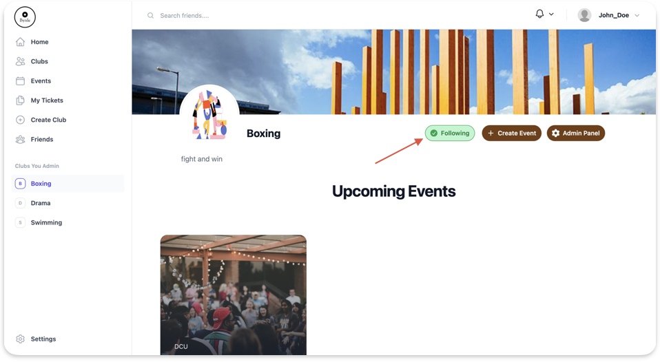
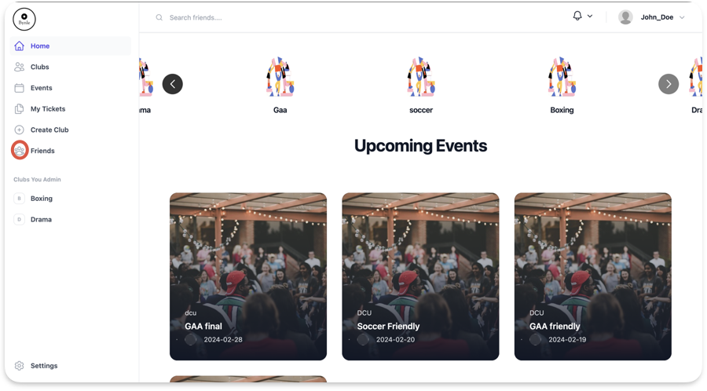
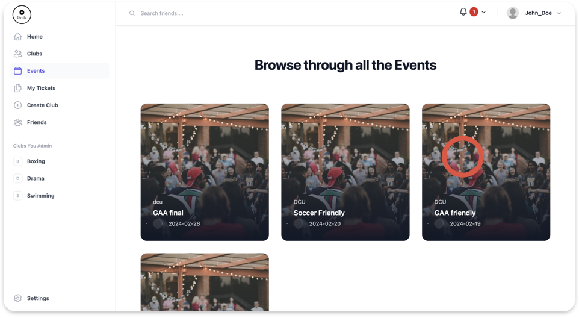
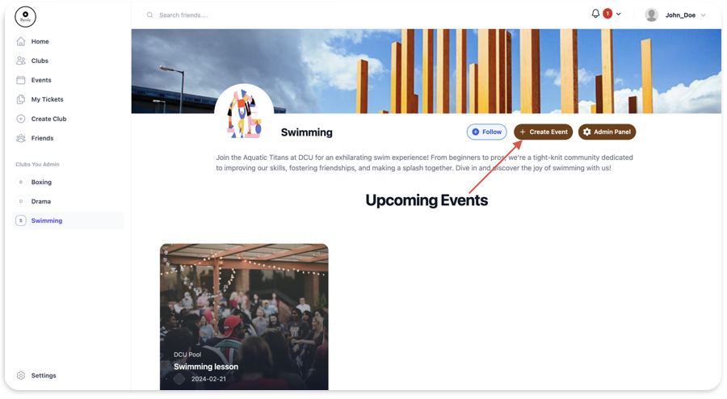

# User Manual: Bynle

# Table of Contents

- [Introduction](#introduction)
  - [1. User Cases](#1-user-cases)
    - [1.1. Creating a Club](#11-creating-a-club)
    - [1.2. Requesting to Follow a Friend](#12-requesting-to-follow-a-friend)
    - [1.3. Following a Club](#13-following-a-club)
    - [1.4. Removing a Friend](#14-removing-a-friend)
    - [1.5. Responding to a friend's Request](#15-responding-to-a-friends-request)
    - [1.6. View Personal Profile](#16-view-personal-profile)
  - [2. Ticketing Cases](#2-ticketing-cases)
    - [2.1. Buying a Ticket for an Event](#21-buying-a-ticket-for-an-event)
    - [2.2. Transferring a Ticket](#22-transferring-a-ticket)
    - [2.3. Confirming Transfer for a Ticket](#23-confirming-transfer-for-a-ticket)
  - [3. Club Admin Cases](#3-club-admin-cases)
    - [3.1. Creating an Event](#31-creating-an-event)
    - [3.2. Setting up Stripe](#32-setting-up-stripe)
    - [3.3. Editing Club Information](#33-editing-club-information)
    - [3.4. Adding Scanner for Event](#34-adding-scanner-for-event)
    - [3.5. Viewing data about club](#35-viewing-data-about-club)
  - [4. Scanner Cases](#4-scanner-cases)
    - [4.1. Scanning a Ticket](#41-scanning-a-ticket)
- [Conclusion](#conclusion)

# **Introduction**

- Overview of Bynle
  - Bynle is a user-friendly web-based ticket-selling platform tailored for university clubs and societies. It offers clubs a seamless solution for event organisation, ticket sales, and attendee management. For users, Bynle serves as a centralised hub to explore events, send friend requests, and securely transfer tickets.”
- Purpose of the User Manual
  - This user manual's objective is to walk users through Bynle's numerous features and assist them in learning how to utilise the platform efficiently. This handbook will provide you with detailed instructions on how to utilise Bynle's main components whether you're a club member, club administrator, or event participant.
- How to Use This Manual
  - This manual is organised into sections based on different user roles and tasks. Each section contains detailed instructions, accompanied by screenshots where applicable, to assist you in using Bynle efficiently. Simply navigate to the relevant section based on your role or the task you wish to perform.

## 1. User Cases

### 1.1. Creating a Club

1.  To create a club in Bynle, follow these steps.

    i. Click the “Create a Club” tab on the side navbar.

    

    ii. Fill in the required information such as club name, description, and contact details.

    iii. Can also upload media for the Club Logo and cover photo.

    iv. Click “Save” to create your club.

    

### 1.2. Requesting to Follow a Friend

1.  To send a friend request on Bynle, here’s what you need to do.

    i. Navigate to the “Search Friends” search bar at the top of the app.
    ii. Type in the username of the user you want to follow.
    iii. Clicking on the user brings you to their profile page.

    

    iv. Click the “Request” button to send a friend request.

    

    v. Wait for the user to accept your friend request.

### 1.3. Following a Club

1.  To follow a club in Bynle:

    i. Click the “Clubs” tab on the side navbar.

    

    ii. Click on the club you want to follow.

    

    iii. Click on the “Follow” button to start following the club.

    

    

## 1.4. Removing a Friend

1.  To remove a friend.

    i. Click the “Friends” tab on the side navbar.

    

    ii. Click the “Remove” button on the friend you want to remove.

    

## 1.5. Responding to a friend's Request

1.  How to Respond to a Friend Request.

    i. Click the bell Icon which should have a number indicating how many requests you have.

    

    ii. Responding to the request:

    a. Click the “+” to add the friend.

    b. Click the “X” to reject the friend request.

    

## 1.6. View Personal Profile

1. To View your profile, follow these steps.

   1. Click your profile icon on the top right.

   

   ii. Click the “Your Profile” button.

2. **View Friends Profile.**
   1. Click the “Friends” tab on the side navbar.
   2. Click on the selected friend’s profile picture.

## 2. Ticketing Cases

### 2.1. Buying a Ticket for an Event

1.  To purchase a ticket for an event on Bynle, follow these steps:

    i. Click on the “Events” tab on the side navbar.

    

    ii. Click on what event you wish to attend.

    

    iii. Click on the “Buy Ticket” button.

    1. If the ticket is free the ticket will be added to the “Mytickets” page
    2. If the ticket cost money follow the prompts to enter payment information and complete the purchase.

    

### 2.2. Transferring a Ticket

1.  If you need to transfer a ticket to someone else, here's what you should do:

    i. Click on “My Tickets” tab on the side navbar.

    ii. Click on the “Transfers” button.

    iii. Click on the “Transfer Tickets” section

    iv. Select a friend and a ticket to transfer.

    

    v. Click the “Send Transfer Request.” button to send the transfer.

### 2.3. Confirming Transfer for a Ticket

1.  If you receive a ticket transfer request, you'll need to confirm it:
    i. If you receive a ticket transfer request, you'll need to confirm it:

    ii. Navigate to the “My Tickets” Page.

    iii. Click the “Transfers” Button.

    iv. Navigate to the Received Transfers Section.

    

    v. Click Accept on the Ticket you want to receive.

## 3. Club Admin Cases

### 3.1. Creating an Event

1.  To create an event as a club admin on Bynle, follow these steps:

    1. Click the Club name under “Clubs You Admin” tab on the side navbar.
    2. Click the “Create Event” button.

    

    iii. Fill in the event details such as event name, date, location, and description.

    iv. Set ticket options and pricing if applicable.

    

    v. Click "Save" to create the event.

### 3.2. Setting up Stripe

1.  If you want to charge for an event and accept payments online, you'll need to set up Stripe:

    i. Click the Club name under the “Clubs You Admin” tab on the side navbar.
    ii. Click the “Admin Panel” button.
    iii. Go to the “Stripe Payments” Section.
    iv. Click the “Create Stripe Account” button.

    

    vi. Complete the Stripe setup process, including verifying your account.

### 3.3. Editing Club Information

1.  To edit club information on Bynle, follow these steps:

    i. Click the Club name under the “Clubs You Admin” tab on the side navbar.
    ii. Click the “Admin Panel” button.
    iii. Go to the “Edit Club” Section.
    iv. Edit the club details such as name, description, and Club Slogan as needed.

    

    vi. Click "Save" to update the club information.

### 3.4. Adding Scanner for Event

1.  To add a scanner for an event on Bynle, here's what you should do:

    i. Click the Club name under the “Clubs You Admin” tab on the side navbar.
    ii. Click the “Admin Panel” button.
    iii. Go to the “Manage Events” Section.
    iv. Click on the “Manage Event” for the event you want to add scanners to.
    v. Fill out the Username, Password and Email details for the scanner accounts.
    vi. Click the “Add Scanner” to create a scanner account to scan tickets for that event.

    

### 3.5. Viewing data about club

1.  to view data about you club follow these steps.
    i. Click the Club name under the “Clubs You Admin” tab on the side navbar.
    ii. Click the “Admin Panel” button.
    iii. Go to the “Club Stats” Section to view the clubs Stats

    

## 4. Scanner Cases

### 4.1. Scanning a Ticket

1.  To scan a ticket using the Bynle scanner, follow these steps:

    i. Log in through the scanner log in with the details the club admin provided.
    ii. Allow permissions to access camera to scan tickets.
    iii. Click “Start Scanning” to bring up camera to scan tickets.

    

    iv. Position the scanner box over QR code on the ticket.

    v. Allow the scanner to capture the QR code.

    vi. Wait for the system to verify the ticket validity.

    vii. If the ticket is valid, proceed with event entry for the attendee.

    

    viii. If the ticket is invalid or already used, follow the protocol for handling such tickets.

    

# Conclusion

Congratulations on completing the Bynle user manual! We hope this guide has provided you with comprehensive insights into the functionality and features of our platform. By utilising this manual, you are now equipped to navigate Bynle with ease, whether you are a club member, club administrator, event participant, or scanner operator.

As you engage with Bynle, remember that our platform is designed to streamline event organisation, ticket sales, and attendee management for university clubs and societies. With Bynle, you can create and manage events, connect with friends and clubs, purchase and transfer tickets seamlessly, and ensure smooth event entry with our integrated scanner system.

We understand that mastering a new platform may come with its challenges, but we are here to support you every step of the way. Should you encounter any difficulties or have questions about Bynle, don't hesitate to refer back to this manual.

Thank you for choosing Bynle as your preferred platform for event management and ticketing. We are committed to continually enhancing our platform to meet your needs and provide you with the best possible experience.

Happy event planning and ticketing!

Sincerely,
The Bynle Team
